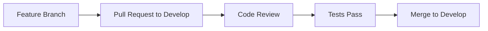
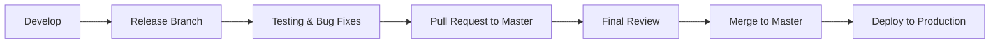
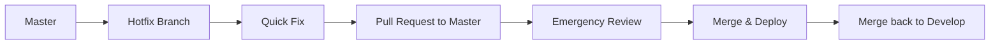

# 🛡️ إعداد Branch Protection Rules

## نظرة عامة

هذا الدليل يوضح كيفية إعداد قواعد حماية الفروع في GitHub لضمان جودة الكود والأمان.

## 🎯 الفروع المحمية

### 1. Master Branch (الفرع الرئيسي)
- **الغرض**: كود الإنتاج المستقر
- **مستوى الحماية**: عالي جداً
- **النشر**: تلقائي للإنتاج

### 2. Develop Branch (فرع التطوير)
- **الغرض**: تجميع الميزات الجديدة
- **مستوى الحماية**: عالي
- **النشر**: تلقائي للـ staging

### 3. Release Branches (فروع الإصدارات)
- **النمط**: `release/*`
- **الغرض**: تحضير الإصدارات
- **مستوى الحماية**: متوسط

## ⚙️ إعدادات الحماية المطلوبة

### 🔒 Master Branch Protection

#### الإعدادات الأساسية:
```yaml
Branch name pattern: master
```

#### Protect matching branches:
- ✅ **Require a pull request before merging**
  - ✅ Require approvals: `2`
  - ✅ Dismiss stale PR approvals when new commits are pushed
  - ✅ Require review from code owners
  - ✅ Restrict pushes that create files larger than 100MB

#### Required status checks:
- ✅ **Require status checks to pass before merging**
- ✅ **Require branches to be up to date before merging**

#### Status checks المطلوبة:
```
- tests (🧪 اختبارات PHP و Laravel)
- code-quality (🎨 فحص جودة الكود)
- assets (🎨 بناء الأصول)
- security-scan
- performance-check
```

#### Additional restrictions:
- ✅ **Restrict pushes that create files larger than 100MB**
- ✅ **Include administrators**
- ✅ **Allow force pushes**: ❌ (محظور)
- ✅ **Allow deletions**: ❌ (محظور)

### 🔧 Develop Branch Protection

#### الإعدادات الأساسية:
```yaml
Branch name pattern: develop
```

#### Protect matching branches:
- ✅ **Require a pull request before merging**
  - ✅ Require approvals: `1`
  - ✅ Dismiss stale PR approvals when new commits are pushed
  - ✅ Require review from code owners

#### Required status checks:
- ✅ **Require status checks to pass before merging**
- ✅ **Require branches to be up to date before merging**

#### Status checks المطلوبة:
```
- tests
- code-quality
- security-scan
```

#### Additional restrictions:
- ✅ **Include administrators**
- ✅ **Allow force pushes**: ❌ (محظور)
- ✅ **Allow deletions**: ❌ (محظور)

### 🚀 Release Branches Protection

#### الإعدادات الأساسية:
```yaml
Branch name pattern: release/*
```

#### Protect matching branches:
- ✅ **Require a pull request before merging**
  - ✅ Require approvals: `1`
  - ✅ Require review from code owners

#### Required status checks:
- ✅ **Require status checks to pass before merging**

#### Status checks المطلوبة:
```
- tests
- security-scan
```

## 👥 Code Owners Setup

### إنشاء ملف CODEOWNERS:

```bash
# ملف .github/CODEOWNERS

# Global owners
* @HA1234098765

# Security-related files
/app/Http/Middleware/ @HA1234098765
/config/security.php @HA1234098765
/.github/workflows/ @HA1234098765
/app/Console/Commands/Security* @HA1234098765

# Database changes
/database/migrations/ @HA1234098765
/database/seeders/ @HA1234098765

# Configuration files
/config/ @HA1234098765
/.env.* @HA1234098765
/composer.json @HA1234098765
/package.json @HA1234098765

# Documentation
/README.md @HA1234098765
/SECURITY.md @HA1234098765
/CONTRIBUTING.md @HA1234098765

# CI/CD files
/.github/ @HA1234098765
/phpstan.neon @HA1234098765
/.php-cs-fixer.php @HA1234098765
```

## 🔄 Workflow للمراجعة

### 1. Feature Development


### 2. Release Process


### 3. Hotfix Process


## 🧪 Required Status Checks

### 1. Tests Check
```yaml
name: tests
description: "جميع الاختبارات يجب أن تنجح"
required: true
contexts:
  - "tests (8.1)"
  - "tests (8.2)"
```

### 2. Code Quality Check
```yaml
name: code-quality
description: "فحص جودة الكود مع PHPStan و PHP CS Fixer"
required: true
contexts:
  - "PHP CS Fixer"
  - "PHPStan Analysis"
  - "Security Checker"
```

### 3. Security Scan
```yaml
name: security-scan
description: "فحص الأمان للثغرات"
required: true
contexts:
  - "Security Audit"
  - "Dependency Check"
```

### 4. Assets Build
```yaml
name: assets
description: "بناء الأصول بنجاح"
required: true
contexts:
  - "Build Assets"
  - "Asset Optimization"
```

## 🚨 Emergency Procedures

### في حالة الطوارئ:

#### 1. Bypass Protection (للمشرفين فقط)
```bash
# خطوات الطوارئ:
1. توثيق سبب التجاوز
2. إنشاء issue للمتابعة
3. تطبيق الإصلاح
4. مراجعة لاحقة إجبارية
```

#### 2. Hotfix Process
```bash
# إنشاء hotfix
git checkout master
git checkout -b hotfix/critical-security-fix

# تطبيق الإصلاح
# ... code changes ...

# إنشاء PR عاجل
gh pr create --title "🚨 HOTFIX: Critical Security Fix" \
             --body "Emergency fix for security vulnerability" \
             --base master \
             --label "hotfix,critical,security"
```

## 📊 Monitoring & Metrics

### مؤشرات الأداء:
- **معدل نجاح PR**: > 95%
- **وقت المراجعة**: < 24 ساعة
- **معدل الرفض**: < 10%
- **تغطية الاختبارات**: > 80%

### تقارير أسبوعية:
- عدد PRs المدمجة
- عدد المراجعات المطلوبة
- الأخطاء المكتشفة
- وقت الاستجابة للمراجعة

## 🛠️ خطوات الإعداد في GitHub

### 1. الذهاب إلى إعدادات المستودع
```
Repository → Settings → Branches
```

### 2. إضافة قاعدة حماية جديدة
```
1. انقر على "Add rule"
2. أدخل اسم الفرع أو النمط
3. حدد الإعدادات المطلوبة
4. احفظ القاعدة
```

### 3. إعداد Status Checks
```
1. في قسم "Require status checks"
2. ابحث عن اسم الـ check
3. حدده من القائمة
4. احفظ التغييرات
```

### 4. إعداد Code Owners
```
1. أنشئ ملف .github/CODEOWNERS
2. أضف قواعد الملكية
3. ادفع التغييرات
4. ستطبق تلقائياً
```

## 🔍 استكشاف الأخطاء

### مشاكل شائعة:

#### 1. Status Check لا يظهر
```bash
# الحل:
1. تأكد من تشغيل الـ workflow مرة واحدة على الأقل
2. تحقق من اسم الـ job في الـ workflow
3. تأكد من وجود الفرع في الـ workflow triggers
```

#### 2. Code Owner لا يعمل
```bash
# الحل:
1. تحقق من صيغة ملف CODEOWNERS
2. تأكد من وجود المستخدم في المستودع
3. تحقق من مسار الملفات
```

#### 3. لا يمكن دمج PR
```bash
# الحل:
1. تحقق من نجاح جميع Status Checks
2. تأكد من وجود المراجعات المطلوبة
3. تحديث الفرع مع الفرع الهدف
```

## 📞 الدعم

في حالة وجود مشاكل في إعداد Branch Protection:
- **GitHub Issues**: أنشئ issue جديد
- **البريد الإلكتروني**: hodifaabdhalmoaz@gmail.com
- **WhatsApp**: 777548421 967+

---

**ملاحظة**: هذه الإعدادات تضمن جودة عالية للكود وأمان المشروع.
